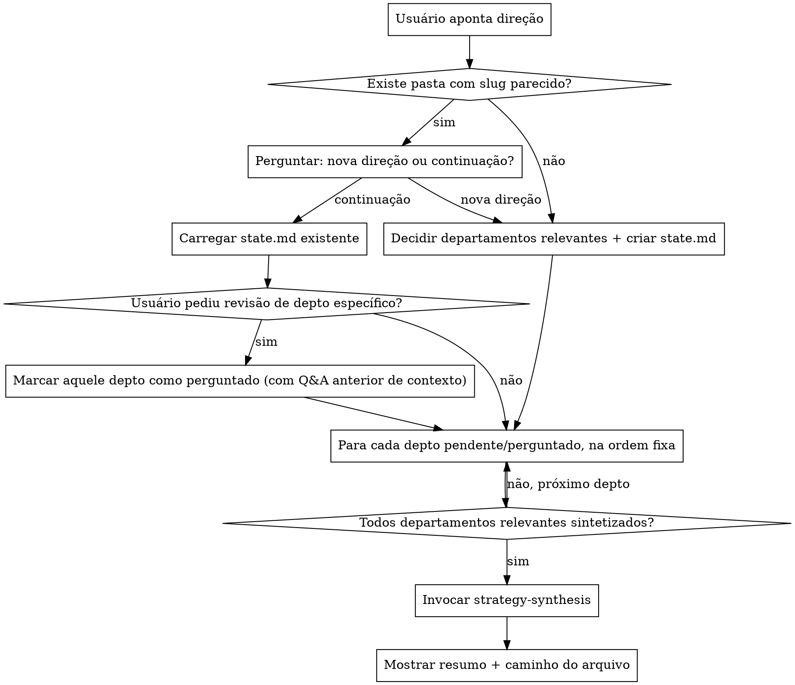

# business-direction

## Overview

Orquestradora de um "CEO virtual": em vez de escrever um plano de negócio inteiro de uma vez (assumindo respostas), esta skill separa a análise por departamento, faz as perguntas de cada área ANTES de redigir qualquer seção, e persiste o progresso em disco para que o usuário possa interromper e retomar sem reprocessar a conversa inteira.

**Regra estrutural:** nenhuma seção de departamento é redigida sem que as perguntas daquele departamento tenham sido feitas ao usuário e respondidas. Pular perguntas e assumir respostas é o erro que esta skill existe para evitar — se você notar que está prestes a escrever uma seção com premissas próprias em vez de respostas do usuário, pare e pergunte primeiro.

## Quando usar

- Usuário aponta uma direção de negócio nova (produto, serviço, pivô) e quer plano estruturado.
- Usuário quer retomar ou revisar uma linha de planejamento já iniciada.
- Usuário quer atualizar só um departamento específico de um plano existente.

**Quando NÃO usar:** usuário só quer pensar sobre uma área isolada, sem processo persistente — nesse caso invoque a subskill do departamento diretamente (`market-positioning`, `sales-pipeline`, `product-scope`, `financial-planning`, `operations-planning`), que responde só no chat sem gravar estado.

## Departamentos e subskills

Ordem fixa de execução (pula os não relevantes): **Product → Marketing → Sales → Finance → Operations**.

| Departamento | Subskill |
|---|---|
| Produto | `product-scope` |
| Marketing | `market-positioning` |
| Vendas | `sales-pipeline` |
| Financeiro | `financial-planning` |
| Operações | `operations-planning` |

Depois de todos os departamentos relevantes estarem `sintetizado`, invoque **sempre por último**: `strategy-synthesis`.

## Onde o estado vive

- `docs/business-direction/<slug>/state.md` se o diretório de trabalho atual é um repositório git.
- `~/.claude/business-direction/<slug>/state.md` caso contrário.

`<slug>` é um kebab-case curto derivado da direção (ex.: "automação de agendamento pra clínicas" → `automacao-agendamento-clinicas`).

## Fluxo



### 1. Identificar a linha de planejamento

Procure em `docs/business-direction/` (ou `~/.claude/business-direction/`) por uma pasta de slug semelhante à direção descrita. Se achar, pergunte ao usuário se é continuação/revisão dessa linha ou uma direção nova (não assuma).

### 2. Se for direção nova

Decida quais departamentos são relevantes olhando para o conteúdo da direção — não rode departamentos que claramente não se aplicam (ex.: uma direção sem produto físico/digital novo pode não precisar de `product-scope`; uma direção sem intenção de venda direta pode ainda assim precisar de `sales-pipeline` se há monetização). Na dúvida, inclua o departamento — é mais barato perguntar e descobrir que não se aplica do que pular algo relevante.

Crie a pasta e o `state.md` com uma seção por departamento relevante, todas com `status: pending`. Formato de cada seção:

```markdown
## <departamento>
status: pending

### Perguntas e respostas
(vazio até ser perguntado)

### Seção redigida
(vazio até status = sintetizado)
```

### 3. Se for continuação

Carregue o `state.md`. Departamentos `sintetizado` são pulados por padrão. Se o usuário pediu para revisitar um departamento específico ("atualiza o financeiro", "revê o marketing"), volte o status desse departamento para `perguntado`, mantendo o Q&A anterior visível como contexto para a subskill.

### 4. Por departamento pendente, um de cada vez, na ordem fixa

a. Invoque a subskill do departamento pedindo só as perguntas daquela área, dado o contexto da direção (e o Q&A anterior, se for revisão).
b. Faça as perguntas ao usuário no chat (use `AskUserQuestion` quando as opções forem discretas; texto livre quando não forem) e aguarde resposta — não avance sem resposta.
c. Repasse a resposta à subskill, que gera a seção redigida.
d. Atualize o `state.md`: status → `sintetizado`, grave o Q&A completo e a seção redigida.

Um departamento de cada vez — não acumule perguntas de vários departamentos numa única rodada; isso é o que permite ao usuário interromper entre departamentos sem perder progresso.

### 5. Ao fim de todos os departamentos relevantes

Invoque `strategy-synthesis`, passando todas as seções já redigidas. Ela cruza informações entre departamentos (ex.: o preço do Sales é compatível com o esforço de MVP do Product?), prioriza e sequencia próximos passos. O resultado vai na seção `## Síntese` do `state.md`.

### 6. Fechamento

Mostre um resumo curto no chat e aponte o caminho do arquivo salvo.

## Retomando uma linha existente

Ao retomar, leia **só o `state.md`** — nunca tente reconstruir contexto lendo transcrições de conversas passadas. O `state.md` já contém tudo destilado (perguntas, respostas, seções prontas); essa é a economia de token que torna o processo interrompível.

## Erros comuns

| Erro | Por quê é errado |
|---|---|
| Escrever a seção de um departamento sem ter perguntado antes | Vira plano genérico com premissas assumidas — exatamente o que esta skill existe para evitar |
| Perguntar todos os departamentos de uma vez no início | Quebra a possibilidade de interromper/retomar por departamento e sobrecarrega o usuário |
| Rodar `strategy-synthesis` antes de todos os departamentos relevantes estarem `sintetizado` | Síntese fica incompleta e pode gerar recomendações contraditórias |
| Reprocessar a conversa inteira ao retomar em vez de ler o `state.md` | Desperdiça tokens e é exatamente o problema que a persistência resolve |
| Rodar departamento claramente irrelevante "por garantia" | Cansa o usuário com perguntas fora de propósito; use a heurística de relevância |
